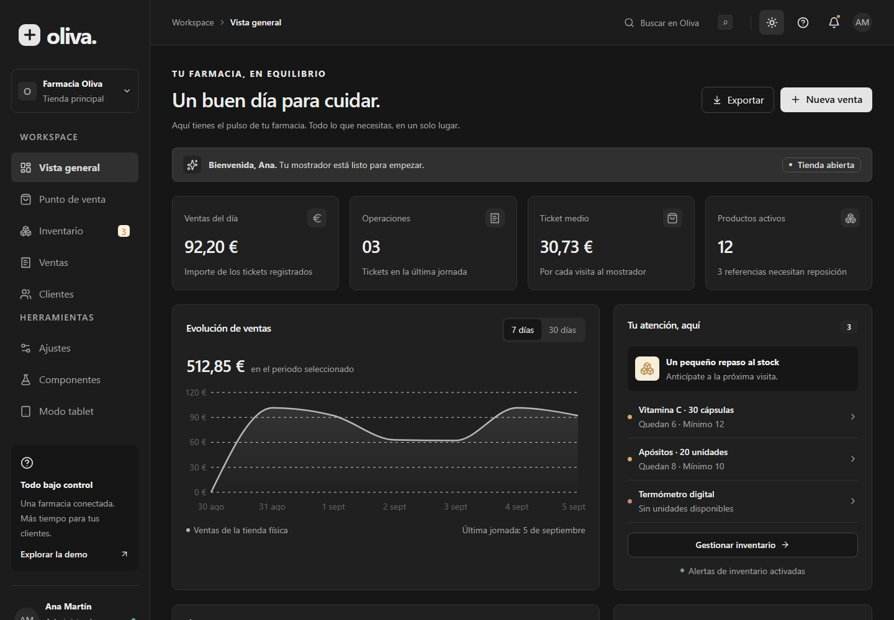
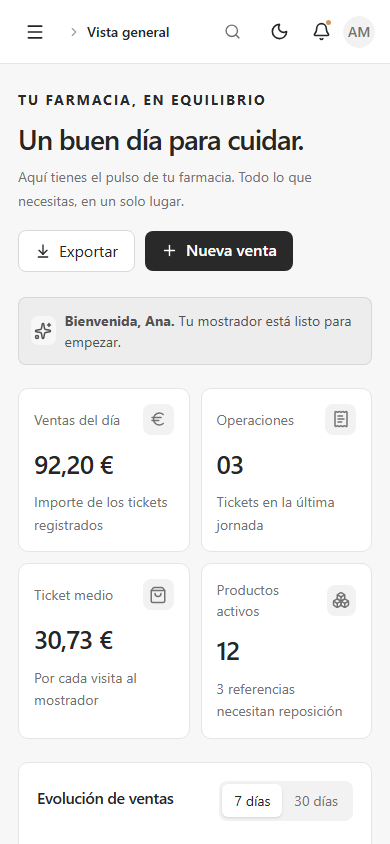
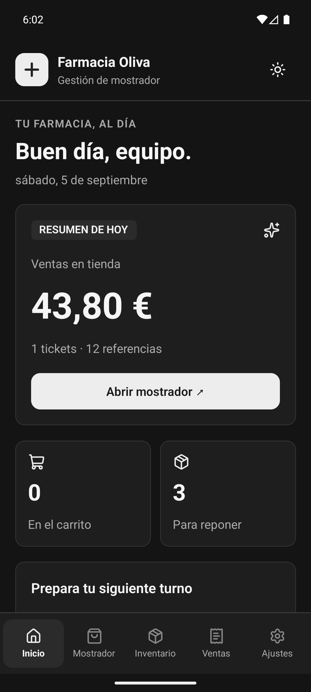
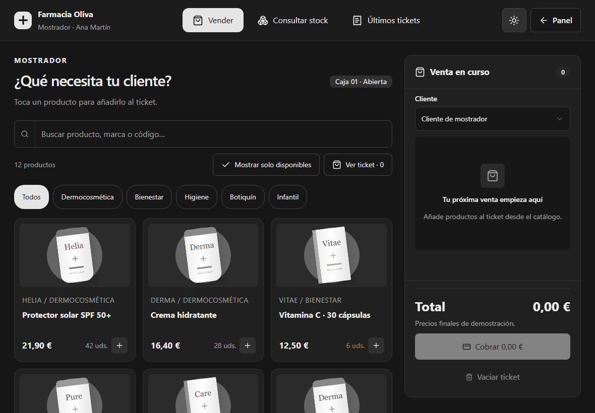

# Kivora UI

Configura una aplicación existente con `npx @kivora/init`. Detecta Next.js o React Native, prepara la instalación y conserva la configuración compatible. Consulta [el instalador y sus versiones soportadas](packages/init/README.md); `--dry-run` permite revisar los cambios sin aplicarlos.

**Un mismo lenguaje visual para Next.js y React Native.**

Componentes en TypeScript para construir interfaces de escritorio, tablet y móvil con temas neutros, modo claro y oscuro y una base de diseño compartida. Cada plataforma conserva sus interacciones: navegación y teclado en web; gestos, controles táctiles y paneles inferiores en la app.

## Web y Android, en una aplicación real

**Farmacia Oliva** muestra los componentes en contexto: gestión de inventario, venta en tienda, clientes, tickets y ajustes. Ambos ejemplos incluyen una galería interactiva para explorar la librería.



| Web en móvil · tema claro | React Native · Android · tema oscuro |
| :---: | :---: |
|  |  |

**Modo tablet:** una interfaz de mostrador con catálogo, búsqueda y ticket de venta en la misma pantalla.



Capturas reales de los ejemplos, sin maquetas. La captura web móvil corresponde al navegador; la de Android, a la aplicación nativa sin Expo. [Cómo actualizar las capturas](docs/images/README.md).

## Elige tu plataforma

| Paquete | Para qué sirve | Instalación y uso |
| --- | --- | --- |
| `@kivora/nextjs` | Componentes React para Next.js, Tailwind CSS 4 y web responsive | [README de Next.js](packages/nextjs/README.md) |
| `@kivora/native` | Componentes React Native con NativeWind, gestos y animaciones | [README de React Native](packages/native/README.md) |
| `@kivora/theme` | Temas, tipos, breakpoints y utilidades compartidas | [README del tema](packages/theme/README.md) |

Los paquetes públicos se publican en npm con versiones independientes. Las instrucciones de consumo se encuentran en cada README; para probar el código actual utiliza el workspace y sus ejemplos.

## Qué comparten

- Formularios: Button, Input, Select, Checkbox, Switch, RadioGroup, Slider, Calendar y DatePicker.
- Presentación: Card, Badge, Avatar, Alert, Attachment, Typography y estados de carga.
- Composición e interacción: Accordion, Tabs, Dialog, Carousel, Table y más.
- Colores semánticos, temas claro/oscuro, tipos de tema y breakpoints compartidos.

El catálogo actual tiene **60 familias web y 56 nativas**. DropdownMenu, Resizable, Command, ContextMenu y NavigationMenu son exclusivos de web; BottomSheet es específico de React Native. La galería nativa contiene 57 ejemplos, incluyendo varias tablas.

La compatibilidad significa una experiencia visual coherente y patrones de composición similares. Las props y las implementaciones se adaptan a cada plataforma: no todos los componentes tienen una API idéntica.

| Comportamiento | Web | React Native |
| --- | --- | --- |
| Filtros de tablas en móvil | Panel inferior; popover en escritorio | Bottom sheet con Gorhom |
| Tablas | DataTable con búsqueda, filtros, orden y selección | Primitivos Table y ejemplos que componen búsqueda, filtros y selección |
| Carousel | Basado en react-slick | Basado en Reanimated, con gestos, controles, autoplay y orientación vertical |
| Tema | Tailwind CSS 4 y variables CSS | NativeWind y variables de color |
| Plataformas del ejemplo | Navegador: escritorio, tablet y móvil | Android, sin Expo; iOS no validado |

Consulta la [cobertura nativa y diferencias de API](docs/native-component-coverage.md), el [carousel nativo](docs/native-carousel.md) y las [decisiones de rendimiento](docs/native-performance.md). La galería Android usa FlashList; eso no implica que todas las listas de la librería usen FlashList.

## Probar los ejemplos

Usa Node.js 22.11 o superior y pnpm 9.15.0 desde la raíz del repositorio:

```sh
pnpm install
```

### Next.js

```sh
pnpm dev:web
```

Abre `http://localhost:3000`. Prueba el dashboard, inventario, punto de venta y ajustes; visita `/componentes` para la galería y `/tablet` para el mostrador táctil. [Detalles del ejemplo web](example/web/README.md).

### Android

Prepara Android Studio, un emulador o dispositivo con depuración USB, Java 17 y las variables `ANDROID_HOME` y `JAVA_HOME`. Las versiones del SDK y los pasos de Windows están en el [README de la app](example/app/README.md).

```sh
# Terminal 1: Metro
pnpm dev:app
```

```sh
# Terminal 2: compilar, instalar y abrir en Android
pnpm android:app
```

Desde **Ajustes → Ver componentes** puedes probar los controles, tablas, filtros y carousel. Las ventas son simuladas y los datos de cada ejemplo se guardan localmente: web y Android no sincronizan inventario ni tickets entre sí.

## Documentación

| Tema | Guía |
| --- | --- |
| Estructura y diseño compartido | [Arquitectura](docs/architecture.md) · [Temas](docs/theming.md) · [Responsive](docs/responsive.md) |
| Formularios web | [DatePicker](docs/date-picker.md) · [Toggle](docs/toggle.md) |
| Tablas y filtros | [DataTable web](docs/data-table-filters.md) · [Ejemplos nativos](docs/native-table-examples.md) |
| Interacciones nativas | [BottomSheet](docs/native-bottom-sheet.md) · [Carousel](docs/native-carousel.md) · [Selección](docs/native-selection.md) |
| Calidad | [Accesibilidad](docs/accessibility.md) · [Rendimiento nativo](docs/native-performance.md) · [Storybook](docs/storybook.md) |

## Desarrollo

```sh
# Compilar los paquetes, sin compilar la aplicación Android
pnpm --filter @kivora/theme build
pnpm --filter @kivora/nextjs build
pnpm --filter @kivora/native build

# Comprobar los paquetes
pnpm --filter @kivora/nextjs typecheck
pnpm --filter @kivora/native typecheck
pnpm --filter @kivora/nextjs test
pnpm --filter @kivora/native test

# Explorar componentes web
pnpm storybook
```

Los README de cada paquete están preparados para acompañar sus distribuciones npm y enlazan los otros módulos de Kivora. No es necesario instalar el paquete web dentro de una aplicación nativa, ni el nativo dentro de una web.
